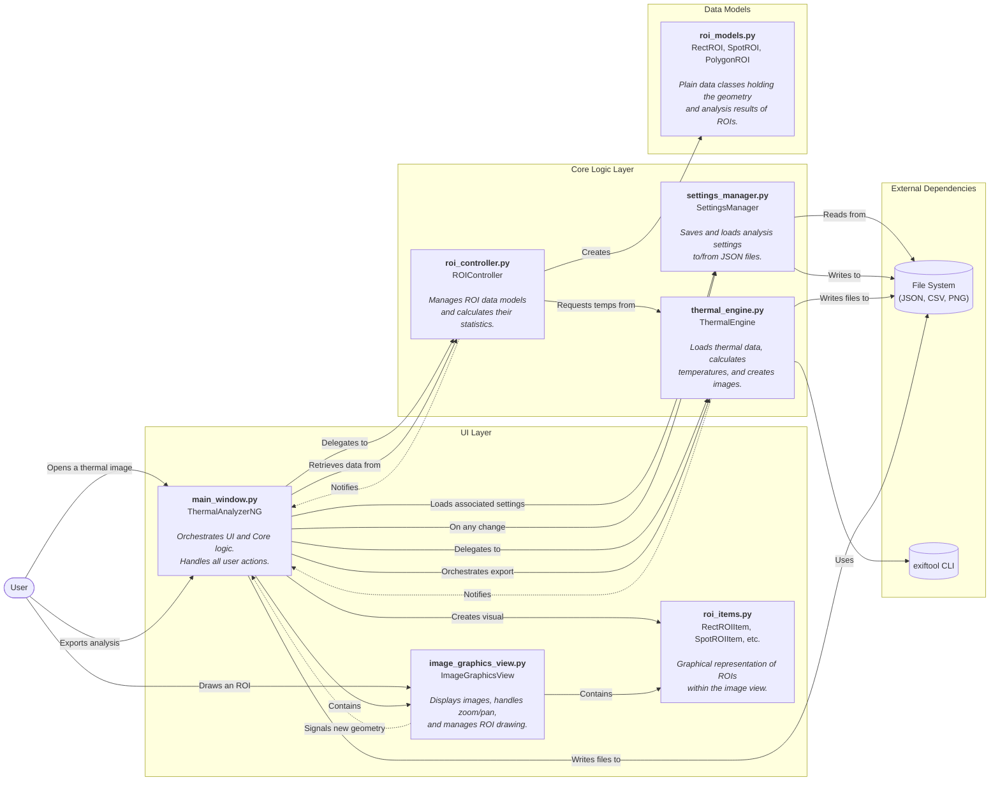

<div align="center">
  
  <p><em>Professional GUI application for thermal image analysis and visualisation</em></p>
</div>

**Warmish** is a cross-platform graphical tool for the advanced analysis of radiometric thermal images (FLIR JPEG). Built on a modern architecture with `QGraphicsView`, it allows you to extract metadata, calculate temperature matrices, visualise thermal maps with customisable palettes, and work with a visible image overlay. The interface, developed in PySide6, offers interactive controls for synchronised zoom/pan, a dynamic legend, a powerful **Region of Interest (ROI) analysis** system, and a comprehensive suite of export tools.

---

### **Current Version Highlights**

*   **Advanced Graphics Architecture:** Fully migrated to `QGraphicsView` and `QGraphicsScene`, ensuring fluid zooming, responsive panning, and optimal management of graphical objects.
*   **Comprehensive ROI Analysis:** Implemented tools to create **Rectangles, Spots (circles), and Polygons**. ROIs are fully interactive: they can be moved, resized via control handles, and edited (vertex editing for polygons).
*   **Real-time Statistics:** A dedicated table displays statistics (min, max, mean, median) for each ROI, updating automatically with every modification and change to thermal parameters.
*   **Automatic Session Saving:** All settings—including ROIs, calculation parameters, and display configurations—are saved to a `.json` file associated with the image, allowing you to resume your work exactly where you left off.
*   **Synchronised Dual View:** When not in overlay mode, the application displays the thermal and visible images in two separate, perfectly synchronised panels for zoom and pan.
*   **Complete Export Suite:** Generate a full analysis package for any image, including thermal maps (with and without ROIs), overlays, visible images, and a detailed CSV data report.
*   **Batch Processing Engine:** Apply a saved analysis configuration (thermal parameters and ROIs) to multiple images at once, automating the export process for entire datasets.

---

## Live Demo

<a href="https://youtu.be/qJgL65pQXTE" title="Watch the Demo on YouTube">
  
</a>

---

## Key Features

- **Radiometric Image Loading (FLIR JPEG)**
  - Extraction of the thermal component (`RawThermalImage`) and FLIR/EXIF metadata via ExifTool.
  - Handling of `RawThermalImage` in PNG format with endianness correction (`byteswap`).

- **Metadata Extraction (ExifTool)**
  - Full metadata reading in JSON format, with a complete display for verification.
  - Key parameters (`Emissivity`, `ObjectDistance`, `PlanckR1`, `PlanckR2`, etc.) are read and pre-filled.
  - Automatic reading and application of overlay alignment metadata (`Real2IR`, `OffsetX`, `OffsetY`).

- **Pixel-level Temperature Calculation**
  - Derivation of the temperature matrix (°C) from radiometric data using Planck parameters and emissivity.
  - Dynamic updates when calculation parameters are modified.

- **Advanced Thermal Visualisation**
  - Temperature colour map with an always-visible legend (`ColorBarLegend`), configurable for ticks, min/max, and precision.
  - Extensive palette selection and **inversion** with a single click.

- **Available Palettes**
  - Iron (Inferno), Rainbow (nipy_spectral), Greyscale, Lava (hot), Arctic (cool), and many more (see `constants.py`).

- **Overlay with Visible Image (on `QGraphicsView`)**
  - Extraction and use of the embedded visible image (`EmbeddedImage`).
  - Toolbar controls: activate overlay, opacity, IR↔Visible scale (`Real2IR`), X/Y offset, and **blending modes** (Normal, Multiply, Screen, Overlay, etc.).
  - "Reset Alignment" button to restore values from metadata.

- **Fluid Interaction (`QGraphicsView`)**
  - Zoom in/out (also with Ctrl + scroll wheel) and zoom reset.
  - Pan by dragging (also with the middle mouse button).
  - Tooltip with pixel temperature (°C) on mouse hover over the thermal image.

- **Full ROI (Region of Interest) Analysis**
  - **Drawing Tools:** Dedicated buttons to create **Spots**, **Rectangles**, and **Polygons**.
  - **Interactive ROIs:**
    - Move with drag & drop.
    - Resize using intuitive control handles.
    - Edit vertices for polygons.
  - **Analysis Table:** A table view with name, **emissivity (editable per-ROI)**, and calculated statistics (Min, Max, Mean, Median) for each area.
  - **On-Image Labels:** Customisable labels display statistics directly above each ROI.
  - **Synchronisation:** Selecting an ROI in the table highlights it in the image, and vice-versa.

- **Automatic Save and Restore**
  - Changes to parameters, palette settings, overlay configuration, and **all created ROIs** are automatically saved to a `.json` file next to the loaded image.
  - Reopening the same image restores the entire analysis session.

- **Comprehensive Export & Batch Processing**
  - **Image Export (PNG):** Save high-resolution versions of the thermal view, visible image, thermal-with-ROIs, and the blended overlay. All thermal exports include the colour legend.
  - **Data Export (CSV):** Generate a detailed CSV file containing all global thermal parameters, temperature statistics, and a full breakdown of every ROI's analysis data.
  - **Batch Processing with Presets:** Load a `.json` analysis file as a preset, select multiple images, and automatically apply the preset's parameters and ROIs to export a complete analysis for each image.

---

## Project Structure

- `main.py` — Application startup, splash screen management, and main window creation.
- `ui/main_window.py` — `ThermalAnalyzerNG` main window: orchestrates all features, from loading to ROI analysis and exporting.
- **`core/thermal_engine.py`** — Handles all backend thermal data processing, temperature calculation, and image generation.
- **`core/roi_controller.py`** — Manages the lifecycle and statistical analysis of all ROIs.
- **`core/settings_manager.py`** — Manages the automatic saving and loading of session data to `.json` files.
- **`ui/widgets/image_graphics_view.py`** — `ImageGraphicsView`, the core of the visualisation. Manages zoom/pan, overlay, and interactive ROI drawing.
- **`analysis/roi_models.py`** — Defines the data model classes for ROIs (`RectROI`, `SpotROI`, `PolygonROI`).
- **`ui/roi_items.py`** — Defines the graphical objects (`QGraphicsItem`) that represent ROIs in the scene, handling their interactivity.
- `ui/widgets/color_bar_legend.py` — The colour legend widget.
- `constants.py` — Maps palette names to Matplotlib colormaps.

### Application Architecture

This project follows a clean, decoupled architecture that separates the User Interface (UI) from the core business logic. This design improves maintainability, testability, and allows for easier future extensions.

The architecture is divided into three main layers: the **UI Layer**, the **Core Logic Layer**, and the **Data Models**, which interact with external tools and the file system.

The following diagram illustrates the primary components and their key interaction flows:



---

## Technical Requirements

- **Language**: Python 3 (developed on 3.13)
- **GUI**: PySide6 (Qt for Python)
- **Processing**: numpy, Pillow (PIL)
- **Colours**: matplotlib
- **Metadata**: ExifTool (system tool) + `pyexiftool` Python binding
- **Platforms**: macOS, Windows (including Windows 11), Linux

---

## Installation

### 1) Prerequisites

- **Python 3** (version 3.13 is recommended for best compatibility with packaging tools).
- **ExifTool** must be installed and accessible in the system `PATH`.
  - **Official website:** [ExifTool](https://exiftool.org)
  - **On macOS (using Homebrew):** `brew install exiftool`
  - **On Windows:** Download the standalone executable, rename it to `exiftool.exe`, and place it in a directory included in your system's PATH.
  - Verify the installation with the command: `exiftool -ver`

### 2) Python Dependencies

Clone the repository and install the required libraries using the `requirements.txt` file. Using a virtual environment is highly recommended.

```bash
git clone https://github.com/yourusername/warmish.git
cd warmish

# Create and activate a virtual environment (recommended)
# On macOS/Linux:
python3.11 -m venv venv
source venv/bin/activate

# On Windows (PowerShell):
# py -3.11 -m venv venv
# .\venv\Scripts\Activate.ps1

# Install dependencies
pip install -r requirements.txt
```

---

## Running the Application

Launch the application with:

```bash
python main.py
```

**Typical workflow:**
1.  Click "Open" and select a radiometric JPEG file.
2.  The app extracts metadata and thermal data. The thermal and visible views are displayed. If a `.json` file exists, the previous session (ROIs, parameters) is loaded.
3.  Use the tools in the "Areas & Analysis" tab to draw **Spots, Rectangles, or Polygons** on the thermal image.
4.  Watch the statistics appear in the table. Move or resize the ROIs and see the data update in real-time.
5.  Modify the emissivity for a single ROI directly in the table to refine the analysis.
6.  Activate "Overlay" to superimpose the images; adjust opacity, scale, offset, and blending mode.
7.  Use zoom and pan to explore details; the views (if separate) will remain synchronised.
8.  All changes are saved automatically.
9.  Use the "Export" tab to save all analysis artefacts (images, overlay, CSV data) for the current image.

---

## Creating a Standalone Executable

To simplify distribution, you can package the application into a standalone executable using **PyInstaller**. This bundles Python, all libraries, and **ExifTool** into a single, easy-to-run package for macOS or Windows.

**1. Prepare ExifTool:**
   - **macOS:** Install ExifTool (e.g., via Homebrew) and copy the executable into the project's root directory: `cp $(which exiftool) ./exiftool_bin`
   - **Windows:** Download the standalone `exiftool(-k).exe`, rename it to `exiftool_bin.exe`, and place it in the project's root directory.

**2. Update Code (if not already done):**
   - Ensure `thermal_engine.py` and `main.py` use the provided `resource_path` function to locate assets like `exiftool_bin` and the splash screen SVG. This has already been done in the current version of the repository.

**3. Run PyInstaller:**
   - From the project's root directory, run the command for your OS.

   **macOS (recommended `--onedir` mode):**
   ```bash
   pyinstaller --name "Warmish" --windowed --onedir --add-binary "exiftool_bin:." --add-data "Warmish Logo.svg:." --icon="Icon.icns" main.py
   ```

   **Windows:**
   ```bash
   pyinstaller --name "Warmish" --windowed --onefile --add-binary "exiftool_bin.exe;." --add-data "Warmish Logo.svg;." --icon="icon.ico" main.py
   ```

The final application will be located in the `dist/` directory.


## Known Limitations

- PDF reporting is not yet implemented.
- Automatic overlay alignment (searching for offset/scale via feature correlation) is not yet implemented; metadata and manual controls are the primary methods for alignment.
- Performance may degrade with an exceptionally high number of complex polygon ROIs (hundreds) on a single image.

---

## Roadmap

The next priorities for development include:

1.  **Advanced Reporting:**
    - Implement PDF report generation that summarises the analysis, parameters, images, and ROI statistics in a professional format.

2.  **UI/UX Refinements:**
    - A persistent status bar with global information (image min/max, temperature under the cursor).
    - The ability to group and manage ROIs (e.g., hide/show groups, perform actions on groups).
    - Saving and loading of alignment presets for the overlay.

3.  **Advanced Analysis Features:**
    - Temperature **histograms** for the global image and for individual ROIs.
    - Additional measurement tools, such as line profiles to plot temperature along a path.
    - More robust input validation with clear user feedback.

4.  **Performance Optimisation:**
    - Further optimising the recalculation pipeline to separate statistics updates from rendering.
    - Intelligent data caching to improve responsiveness.

5.  **Packaging and Distribution:**
    - **DONE:** Creating standalone executable packages for macOS and Windows to simplify distribution to end-users.
    - **NEXT:** Automate the build process (e.g., via GitHub Actions) and implement code signing for macOS.

---

## Licence

Distributed under the GNU GPLv3 Licence. See `LICENSE` for more information.
